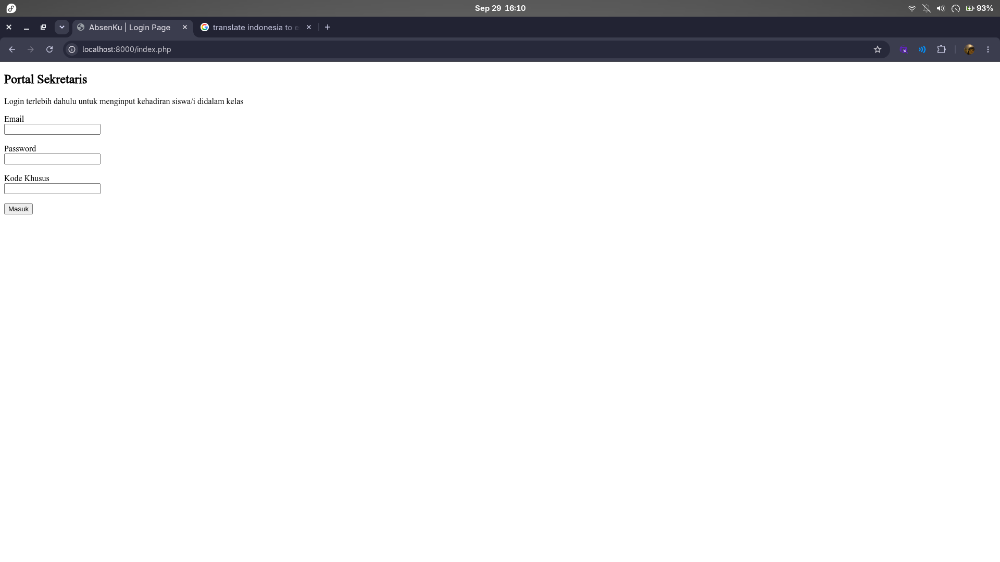
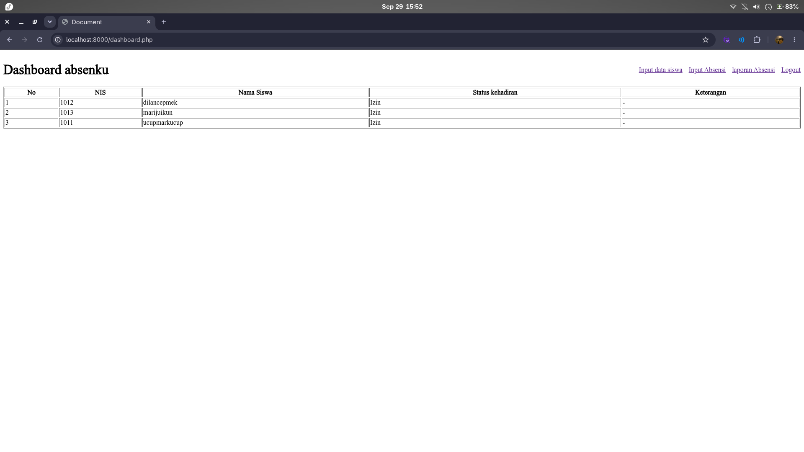
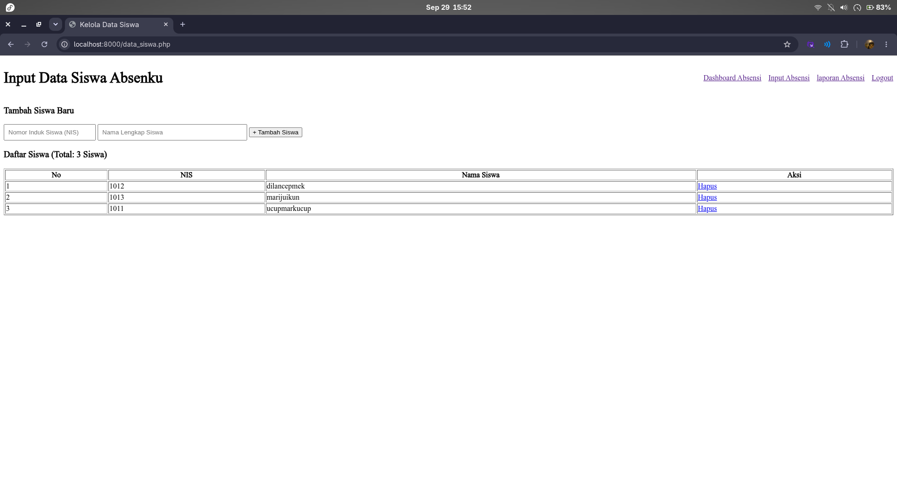
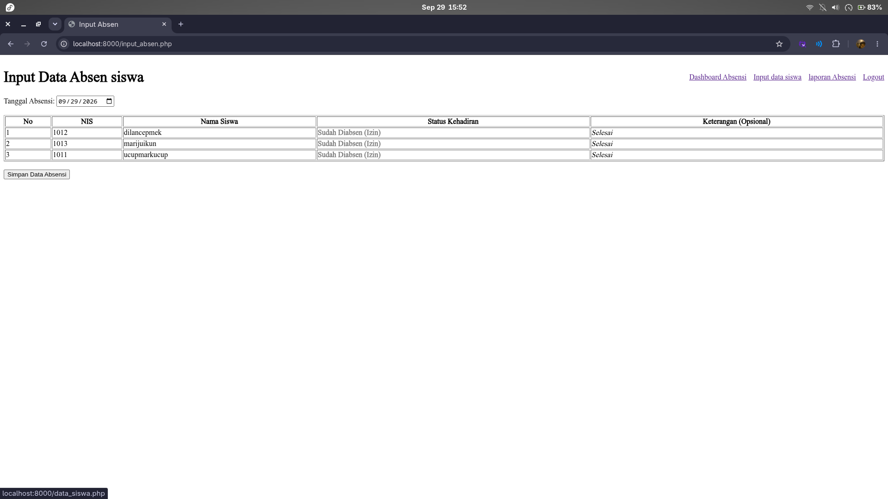
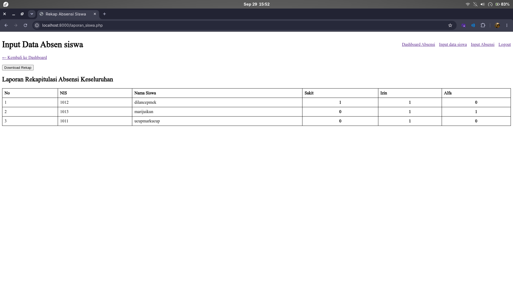

### SPOTIFY · DEVELOPER SESSION
> **TOP TRACKS** yang menemani developer pertama merangkai fondasi awal AbsensiKu

[](https://open.spotify.com/search/About%20You)

[](https://open.spotify.com/search/The%20Cure)

[](https://open.spotify.com/search/Heaven)

[](https://open.spotify.com/search/Abadi)

[](https://open.spotify.com/search/Tunggulah%20Aku%20Di%20Jakarta)

[](https://open.spotify.com/search/Jatuh%20Suka)

# AbsensiKu

Aplikasi absensi siswa berbasis PHP dan MySQL/MariaDB. Aplikasi ini masih berada pada tahap awal: antarmuka belum mendapatkan desain CSS khusus dan masih berupa HTML sederhana dengan logika PHP. Beberapa elemen memakai style inline dasar, tetapi belum ada sistem desain atau stylesheet untuk tampilan yang konsisten. Aplikasi menyediakan halaman untuk melihat status kehadiran hari ini, mengelola daftar siswa, mencatat absensi, dan mencetak rekapitulasi.

> **Status proyek:** versi awal/prototipe. Baca bagian [Catatan untuk tim](#catatan-untuk-tim-sebelum-digunakan) sebelum menyiapkan lingkungan bersama atau memakai data nyata.

> **Disclaimer:** Proyek ini merupakan versi pertama yang masih dalam tahap awal dan belum melalui revisi menyeluruh. Fitur, alur kerja, dan tampilan yang ada disediakan sebagai bahan diskusi bersama tim untuk evaluasi dan pengembangan selanjutnya, bukan sebagai versi final atau siap produksi.

## Daftar Isi

- [Fitur dan alur kerja](#fitur-dan-alur-kerja)
- [Screenshot halaman](#screenshot-halaman)
- [Teknologi dan struktur file](#teknologi-dan-struktur-file)
- [Menjalankan secara lokal](#menjalankan-secara-lokal)
- [Panduan penggunaan](#panduan-penggunaan)
- [Catatan untuk tim sebelum digunakan](#catatan-untuk-tim-sebelum-digunakan)

## Fitur dan alur kerja

1. **Login sekretaris** melalui `index.php` menggunakan email, password, dan kode khusus.
2. **Kelola data siswa** di `data_siswa.php`: tambah siswa dengan NIS dan nama, lihat daftar siswa, atau hapus siswa.
3. **Input absensi** di `input_absen.php`: pilih status Hadir, Sakit, Izin, atau Alpa dan isi keterangan opsional.
4. **Pantau dashboard** di `dashboard.php`: daftar siswa beserta status dan keterangan absensi untuk hari ini. Siswa yang belum memiliki catatan ditampilkan sebagai "Belum diisi".
5. **Cetak rekap** di `laporan_siswa.php`: lihat jumlah Sakit, Izin, dan Alpa per siswa, lalu gunakan tombol **Download Rekap** untuk membuka dialog cetak browser dan memilih **Save as PDF**.

Alur kerja yang disarankan: siapkan daftar siswa terlebih dahulu, input absensi, tinjau dashboard, lalu cetak rekap saat diperlukan.

## Screenshot halaman

Simpan screenshot di folder `docs/screenshots/` dengan nama berikut. Gambar akan tampil otomatis setelah file diletakkan di lokasi yang sesuai.

### Login page

File: `docs/screenshots/login.png`



### Dashboard

File: `docs/screenshots/dashboard.png`



### Input siswa

File: `docs/screenshots/input-siswa.png`



### Input absensi

File: `docs/screenshots/input-absensi.png`



### Cetak laporan

File: `docs/screenshots/cetak-laporan.png`



Untuk tampilan yang konsisten, ambil gambar setelah halaman selesai dimuat dan gunakan ukuran/zoom browser yang serupa untuk setiap screenshot. Pastikan screenshot tidak menampilkan password, kode khusus, atau data pribadi siswa yang tidak boleh dibagikan.

## Teknologi dan struktur file

- **PHP** dengan ekstensi MySQLi untuk logika halaman dan koneksi database.
- **MySQL/MariaDB** untuk menyimpan akun sekretaris, data siswa, dan catatan absensi.
- **HTML sederhana dan PHP** untuk halaman dan logika aplikasi; belum ada desain CSS khusus atau framework frontend. Beberapa style inline dipakai untuk kebutuhan dasar, dan fitur cetak laporan menggunakan dialog print bawaan browser.

```text
.
|-- index.php                 # Login sekretaris
|-- dashboard.php             # Ringkasan absensi hari ini
|-- data_siswa.php            # Tambah, lihat, dan hapus siswa
|-- input_absen.php           # Pencatatan absensi
|-- laporan_siswa.php         # Rekap dan cetak ke PDF
|-- config/
|   |-- koneksi.php            # Konfigurasi koneksi database
|   `-- database.sql          # Skema dan data awal (perlu koreksi; lihat catatan)
|-- proses/
|   `-- logout.php            # Penghapusan sesi dan kembali ke halaman login
`-- docs/
	`-- screenshots/          # Screenshot dokumentasi
```

## Menjalankan secara lokal

### Prasyarat

- PHP CLI terpasang. Tim disarankan memakai PHP 8.x dengan versi minor yang sama agar lingkungan pengembangan konsisten; proyek ini belum memiliki matriks versi PHP yang diuji secara resmi.
- Ekstensi `mysqli` aktif pada PHP yang digunakan oleh server web.
- MySQL atau MariaDB berjalan.
- Browser modern.

Sebelum memulai, buka terminal di komputer masing-masing dan cek PHP:

```bash
php -v
php --ri mysqli
```

Perintah pertama menampilkan versi PHP CLI, sedangkan perintah kedua memastikan ekstensi `mysqli` tersedia. Jika perintah `php` tidak ditemukan, instal PHP CLI sesuai sistem operasi atau gunakan paket pengembangan lokal seperti XAMPP/Laragon, lalu buka terminal baru dan ulangi pemeriksaan. Jika `mysqli` tidak ditemukan, aktifkan atau instal ekstensi tersebut untuk versi PHP yang dipakai, kemudian cek kembali.

Pastikan juga server web memakai instalasi PHP yang sama dengan hasil `php -v`; PHP CLI dan PHP yang terhubung ke Apache dapat memiliki versi atau ekstensi berbeda. Belum ada skrip Composer atau pengelola dependensi PHP yang harus dijalankan pada tahap proyek ini.

### Nyalakan MySQL dengan Laragon

1. Buka Laragon.
2. Pilih **Start All** untuk menyalakan layanan lokal. Jika hanya perlu database, gunakan menu MySQL untuk memulai layanan MySQL/MariaDB saja; nama menu dapat berbeda antarversi Laragon.
3. Pastikan indikator MySQL menunjukkan layanan berjalan. Jika gagal, periksa pesan Laragon dan pastikan port MySQL (umumnya `3306`) tidak sedang dipakai layanan lain.
4. Buka **Menu > Laragon > Terminal** agar perintah MySQL menggunakan program dan konfigurasi yang disediakan Laragon.

### Buat database dengan Laragon dan phpMyAdmin (disarankan)

Metode yang disarankan untuk tim adalah menyalakan MySQL dari Laragon, lalu menjalankan SQL melalui phpMyAdmin. Gunakan isi `config/database.sql` sebagai sumber skema dan data awal. File tersebut berisi perintah untuk membuat database `absensi_pure_html_php`, memilih database itu, membuat tabel sekretaris/siswa/absensi, dan memasukkan akun contoh. Jadi, database tidak perlu dibuat manual terlebih dahulu.

Sebelum menjalankannya, buka `config/database.sql` dan koreksi dua masalah yang ada saat ini: ubah komentar `//` menjadi komentar SQL yang valid (misalnya `-- komentar`) dan ubah kolom `pasword` pada perintah `INSERT` menjadi `password`. Sampai dua hal ini dibetulkan, file belum bisa dijalankan dengan sukses. Pastikan juga nilai akun contoh hanya digunakan untuk pengembangan lokal.

Ikuti langkah berikut:

1. Di Laragon, pilih **Start All** dan pastikan MySQL/MariaDB berjalan.
2. Buka phpMyAdmin melalui menu Laragon (**Menu > MySQL > phpMyAdmin**, nama menu bisa berbeda antarversi) atau kunjungi `http://localhost/phpmyadmin` jika phpMyAdmin sudah tersedia.
3. Login menggunakan akun MySQL lokal, biasanya `root`; pada instalasi Laragon tertentu password-nya kosong.
4. Buka tab **SQL**. Tidak perlu membuat atau memilih database terlebih dahulu karena file SQL sudah berisi perintah `CREATE DATABASE` dan `USE`.
5. Buka `config/database.sql` di editor, salin seluruh isinya setelah koreksi di atas, lalu tempelkan ke kolom query pada tab **SQL**.
6. Klik **Go/Kirim** untuk menjalankan query. Pastikan phpMyAdmin menampilkan pesan sukses dan database `absensi_pure_html_php` muncul pada daftar database.

Skrip membuat database `absensi_pure_html_php`, tabel `tabel_sekretaris`, `tabel_siswa`, dan `tabel_absensi`, serta satu akun sekretaris contoh. Jalankan pada database baru satu kali; skrip belum dirancang untuk diimpor berulang kali.

### Alternatif: jalankan melalui MySQL CLI

Jika tidak menggunakan phpMyAdmin, buka **Menu > Laragon > Terminal** dan periksa klien MySQL:

```bash
mysql --version
mysql -u root -p
```

Masukkan password MySQL saat diminta. Jika akun `root` Laragon tidak menggunakan password, tekan Enter pada prompt password. Untuk menjalankan file yang sama, buka terminal sistem operasi di direktori utama proyek, yaitu direktori yang berisi folder `config/`:

```bash
mysql -u root -p < config/database.sql
```

Masukkan password MySQL saat diminta. Jika akun `root` Laragon tidak menggunakan password, gunakan perintah tanpa `-p`:

```bash
mysql -u root < config/database.sql
```

Alternatifnya, setelah masuk ke prompt MySQL, jalankan file yang sama dengan perintah `SOURCE` dan path absolut proyek:

```sql
SOURCE C:/path/ke/proyek/config/database.sql;
```

Pada Windows, gunakan garis miring `/` pada path seperti contoh. Pada Linux/macOS, gunakan path absolut yang sesuai, misalnya `SOURCE /home/user/proyek/config/database.sql;`. Jalankan proses ini satu kali pada database baru; skrip belum dirancang untuk diimpor berulang kali.

Terakhir, sesuaikan host, user database, password database, dan nama database di `config/koneksi.php` dengan konfigurasi Laragon. Jangan menaruh kredensial pribadi pada repositori bersama. Untuk memastikan PHP tersambung ke database, jalankan aplikasi dan akses halaman yang membaca database.

Akun contoh yang tercantum di skrip SQL adalah `sekretaris@gmail.com`; password contoh dan kode khusus hanya untuk pengembangan lokal. Ganti sebelum aplikasi dipakai bersama, dan jangan gunakan kredensial contoh untuk data nyata.

### Jalankan server PHP

Dari direktori utama proyek:

```bash
php -S localhost:8000
```

Buka <a href="http://localhost:8000" target="_blank">http://localhost:8000</a> di browser. Halaman login aplikasi adalah `index.php`.

## Panduan penggunaan

### 1. Masuk sebagai sekretaris

Buka `index.php`, lalu isi email, password, dan kode khusus yang cocok dengan data pada tabel `tabel_sekretaris`. Jika berhasil, aplikasi mengarahkan pengguna ke dashboard.

### 2. Tambah atau kelola siswa

Buka **Input data siswa**, isi NIS dan nama lengkap, lalu pilih **Tambah Siswa**. Daftar di bawah formulir menampilkan siswa yang tersimpan. Gunakan **Hapus** hanya setelah memastikan pilihan siswa benar; tindakan ini menghapus data siswa dari database.

### 3. Catat kehadiran

Buka **Input Absensi**, tentukan tanggal dan pilih satu status untuk setiap siswa yang belum tercatat. Keterangan seperti alasan izin atau informasi surat dokter bersifat opsional. Pilih **Simpan Data Absensi** setelah semua pilihan siap.

Pada implementasi saat ini, satu siswa yang sudah memiliki catatan untuk tanggal yang dibaca halaman tidak dapat dipilih ulang dari formulir. Periksa tanggal dan data sebelum menyimpan.

### 4. Tinjau dashboard dan cetak rekap

Dashboard menampilkan catatan untuk tanggal hari ini. Di halaman **Laporan Absensi**, tinjau jumlah Sakit, Izin, dan Alpa per siswa. Pilih **Download Rekap**, lalu pilih printer atau **Save as PDF** pada dialog browser. Tautan dan tombol pada halaman tidak ikut tercetak.

## Catatan untuk tim sebelum digunakan

Proyek ini adalah versi pertama dengan fondasi dasar yang telah dibuat oleh developer pertama: login, pengelolaan data siswa, pencatatan absensi, dashboard, dan rekap sederhana. Tugas tim berikutnya adalah meninjau fondasi tersebut, menyepakati arah pengembangan, lalu menambahkan perbaikan atau fitur secara bertahap. Usulan di bawah merupakan bahan diskusi, bukan daftar pekerjaan yang wajib langsung dikerjakan.

### Agenda diskusi

1. **Arsitektur database**
	- Apakah struktur tabel siswa, sekretaris, dan absensi sudah sesuai dengan alur kerja yang disepakati?
	- Aturan data apa yang perlu ditetapkan, misalnya NIS harus unik, satu siswa hanya memiliki satu catatan per tanggal, serta hubungan dan penghapusan data absensi ketika data siswa berubah?
	- Apakah ke depannya perlu mendukung kelas/rombel, tahun ajaran, lebih dari satu petugas, atau riwayat perubahan absensi?
	- Sebelum database digunakan bersama, tinjau dan uji `config/database.sql`. Saat ini masih ada komentar `//` yang bukan sintaks komentar SQL dan typo `pasword` pada perintah `INSERT`; keduanya perlu dibereskan. Pertimbangkan juga batasan unik dan aturan integritas data setelah kebutuhan disepakati.

2. **Arah desain dan struktur website**
	- Desain visual/CSS belum dimulai. Pengembangan desain sebaiknya menunggu persetujuan guru agar warna, tata letak, identitas, dan gaya tampilan sesuai arahan.
	- Sambil menunggu persetujuan, tim dapat membahas struktur navigasi, urutan alur kerja, tampilan tabel/formulir, serta kebutuhan penggunaan di desktop dan ponsel tanpa menetapkan desain final.
	- Setelah desain disetujui, sepakati komponen atau aturan tampilan bersama agar halaman login, dashboard, formulir, dan laporan terasa konsisten.

3. **Fitur yang mungkin ditambahkan**
	- Penyuntingan data siswa dan koreksi absensi dengan konfirmasi serta riwayat perubahan.
	- Filter laporan berdasarkan tanggal, kelas, atau rentang waktu, dan pilihan ekspor yang dibutuhkan tim.
	- Ringkasan jumlah hadir/sakit/izin/alpa dan indikator siswa yang belum diabsen.
	- Validasi input, pembatasan akses semua halaman internal, serta pengelolaan kredensial yang lebih aman.
	- Fitur lain berdasarkan masukan guru dan kebutuhan pengguna.

	Prioritaskan fitur berdasarkan manfaat dan waktu yang tersedia. Implementasikan hanya jika disepakati tim dan memungkinkan dari sisi kebutuhan, keamanan, serta kemampuan teknis; tidak semua usulan harus masuk ke versi berikutnya.

4. **Uji alur yang sudah ada**
	- Uji pembuatan database pada database baru dan pastikan koneksi pada `config/koneksi.php` sesuai lingkungan lokal.
	- Periksa alur login/logout dan pastikan semua halaman internal menerapkan aturan akses yang disepakati.
	- Uji absensi untuk tanggal hari ini maupun tanggal lain; saat ini formulir mengirim tanggal pilihan, tetapi daftar statusnya masih membaca tanggal hari ini.
	- Simulasikan alur dari menambah siswa, mencatat absensi, meninjau dashboard, hingga mencetak laporan. Catat perilaku yang membingungkan atau hasil yang tidak sesuai.

### Cara kerja tim

Bahas dan sepakati kebutuhan bersama sebelum mengubah struktur database atau memulai desain final. Catat keputusan, penanggung jawab, dan hal yang masih perlu persetujuan guru. Setelah keputusan jelas, kerjakan perubahan kecil secara bertahap, uji alur terkait, lalu perbarui dokumentasi. Jaga komunikasi agar asumsi yang berbeda tidak berkembang menjadi kesalahpahaman.
